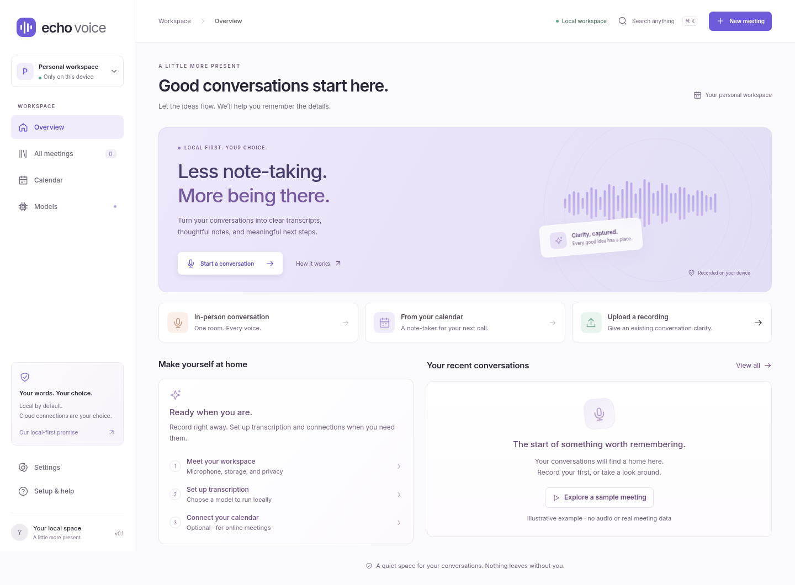

# Echo Voice

Record a conversation, turn it into text, and create meeting notes. Echo Voice opens in your browser and saves your meetings on your computer.



## Start here

**You don't need to write code to use Echo.** You do need to start Echo on your computer before opening it in your browser. The steps below show you how.

The ready-to-run package is for **Linux computers with a 64-bit Intel or AMD processor**. Use a recent desktop Chrome or Chromium browser. You'll need internet access to download the app and its speech model the first time. You can record and transcribe without a Google or ChatGPT account.

If you use a Mac or Windows computer, there isn't a tested installer for you yet. The [developer guide](docs/development.md) explains the source-build options and their limits.

- [Set up Echo](#set-up-echo)
- [Record your first conversation](#record-your-first-conversation)
- [Turn the recording into text](#turn-the-recording-into-text)
- [Create meeting notes](#create-meeting-notes)
- [Connect online meetings](#connect-online-meetings)
- [Save a backup and update Echo](#save-a-backup-and-update-echo)
- [Get help](#get-help)
- [For developers](#for-developers)

## Set up Echo

### 1. Get the ready-to-run download

You need a file named **`echo-voice-linux-x64.tar.gz`**. Use the package supplied with Echo, or look for that exact filename on the [GitHub releases page](https://github.com/samarthmn/echo-voice-web/releases).

If it isn't listed there and you haven't been given the package, the ready-to-run download isn't available to you yet. Someone will need to [build and package Echo](docs/development.md#make-a-downloadable-package) first. GitHub's **Code → Download ZIP** contains the code; it won't run on its own.

### 2. Unpack the download

1. Find the downloaded file, usually in your **Downloads** folder.
2. Right-click it and choose **Extract**. If that option isn't shown, open the file in your archive app and extract it there.
3. Move the extracted **echo-voice-web** folder to somewhere you'll keep it, such as **Documents**.
4. Open that folder. You should see a file called `README.md` and folders called `scripts`, `public`, and `target`.

Keep the whole folder together. Echo will save your meetings inside it by default.

### 3. Start Echo

1. Inside the **echo-voice-web** folder, right-click an empty space and choose **Open in Terminal**. A terminal is a window where you enter commands.
2. Copy the line below, paste it into that window, and press **Enter**. In most Linux terminals, paste with **Ctrl+Shift+V**.

   ```bash
   bash scripts/start.sh
   ```

3. Leave the terminal open. You should see a message with the address `http://localhost:3000`.

If your file manager doesn't have **Open in Terminal**, open the Terminal app, type `cd ` with a space after it, drag the Echo folder into the window, and press Enter. Then run the command above.

### 4. Open Echo

Open **[http://localhost:3000](http://localhost:3000)** in Chrome or Chromium. Put the address in the browser's address bar. `localhost` means your own computer.

You should see **Overview**. You can open the labeled sample meeting to explore the interface. Its text is an example; it doesn't have recorded audio.

### Close Echo and return later

Finish any recording with **Stop & save** and wait for saving and processing to finish. Then go to the terminal and press **Ctrl+C** to stop Echo.

Next time, open a terminal in the same Echo folder, run `bash scripts/start.sh`, and open the same browser address. Your saved meetings will still be there. Use the same browser and browser profile each time to keep access to your downloaded speech models. If you switch profiles or use a private browsing window, you may need to download them again.

## Record your first conversation

Try a short recording before using Echo for an important meeting.

1. Choose **New meeting → In person**.
2. Choose **Test access**. When the browser asks to use your microphone, choose **Allow** and select the microphone you want.
3. Confirm that everyone has agreed to be recorded, then choose **Start recording**.
4. Speak for a few seconds. Keep the browser tab and terminal open.
5. Choose **Stop & save**.
6. Open the saved meeting and play the audio to check that you can hear it.

Already have an audio file? Choose **Upload a recording** on the Overview page instead.

## Turn the recording into text

Echo needs a **speech model** to recognize words. This is a set of files you download once. Turbo and speaker detection run in your browser. Full Large V3 uses a native local engine and stores its speech files in Echo's data folder.

1. Open **Models → Speech models**.
2. Choose **Whisper Large V3 Turbo** (the default, about 1.2 GB including speaker models) or **Whisper Large V3** (about 1.7 GB). Both support multiple languages. Choose **Download model**. If an older download needs word timestamps, choose **Download update**. Large models need substantial free memory and disk space. Full Large V3 also requires Node.js 22 or newer: install it, then run `npm ci --ignore-scripts` in the Echo folder before downloading the model. Turbo does not require Node.js at runtime. See [native engine setup](docs/native-speech.md).
3. Keep the tab open until you see **Downloaded · ready to use**.
4. Open **Settings → General**, select that speech model and your recording language, and save your changes.
5. Return to the saved meeting and choose **Create transcript**.

A transcript is the written version of your recording. Check it for mistakes. You can edit the text and speaker labels, then use timestamps to listen to the original audio.

Transcription happens after recording. If automatic transcription is enabled and your selected model is already downloaded, Echo can start it when you save a recording.

Use the sun/moon button in the top bar to switch between light and dark mode. Echo remembers this preference in your browser; until you choose, it follows your system appearance.

## Create meeting notes

Create a transcript first. Then choose how you'd like Echo to turn it into notes. You can skip this section if you only want to record, transcribe, or listen back.

### Keep the notes on your computer

Echo uses **Ollama** for local notes. Ollama is a separate program that runs a notes model on your computer.

1. Install [Ollama](https://ollama.com/download) and follow its instructions to start it.
2. In Echo, open **Models → Local notes** and choose **Check connection**. You should see **Ollama connected**.
3. Download the selected notes model in that panel. The default is `qwen2.5:3b`. This download is much larger than the speech model, so allow enough disk space and time.
4. Open a meeting with a transcript, choose **Notes**, then **Generate meeting notes**.

Keep Ollama running while you create notes. In **Settings → General**, the default notes provider should be **Ollama · Local**.

### Use your ChatGPT account

This is optional and needs internet access. It uses an eligible ChatGPT plan's **Codex allowance**; it doesn't use OpenAI API credits or a general ChatGPT token balance.

1. Open **Models → ChatGPT**.
2. Choose **Sign in with ChatGPT**, then **Open ChatGPT sign-in**. Complete the OpenAI sign-in page and return to Echo.
3. Wait for **Connected**, then choose **Use ChatGPT for notes**. You can leave the model set to **Account default**.
4. Open a meeting with a transcript and request notes. Read the confirmation before sending.

**Each confirmed request sends the whole transcript version you're using, including speaker labels, to OpenAI.** Selecting a few passages doesn't limit what is sent. Your audio stays local. Connecting your account alone doesn't send a transcript.

If Echo says a helper is missing, follow the [ChatGPT setup guide](docs/chatgpt.md#local-helper-setup). The helper is a small supporting program; Echo requires Codex version **0.160.0**. Your account determines which models and included usage are available. Echo stops if it can't confirm included usage and won't switch to paid API billing.

Whichever option you use, check the notes before sharing them. Names, decisions, dates, and action items can be wrong.

## Connect online meetings

The Echo browser extension records the meeting you attend in your existing Brave or Chrome session. It captures call audio and, with microphone permission, your voice while the meeting identifies your microphone as unmuted. It never requests camera access. Google Calendar is optional and read-only; **Open meeting** opens a link without recording it.

Follow the [extension installation guide](docs/browser-extension.md). The extension stores recordings in its browser profile even when Echo is closed, then transfers them into your paired local library. Optional live text requires a running Echo workspace with Turbo already downloaded. Final transcription and notes use your existing selected models. No Docker, separate meeting browser or meeting runner is required.

Compatibility qualification for each browser, OS and meeting service is tracked separately. An unpacked development package is not a store release. See [qualification and Ubuntu handoff](docs/extension-qualification.md) and [migration and recovery](docs/extension-migration.md).

## Save a backup and update Echo

### Where your meetings live

Open **Settings → Storage** to see where Echo saves your files. Normally, they're in a hidden folder called **`.echo-data`** inside the Echo folder. Don't delete that folder when cleaning up or updating.

Speech models are stored separately in your browser. Clearing browser data may remove those downloads, but it won't erase your saved meeting library. Ollama keeps its own notes models. Echo doesn't encrypt your saved files; your computer's disk encryption can protect them.

### Make a backup

1. Wait for recording and processing to finish.
2. Open **Settings → Storage → Export library**.
3. Save the downloaded backup somewhere outside the Echo folder.

This backup includes audio, meeting text, saved versions, settings, and vocabulary. It doesn't include sign-in credentials or downloaded models. Restoring it needs an empty meeting library and vocabulary; you'll sign in to optional accounts again. Backups from the older desktop Echo app aren't compatible.

The export inside an individual meeting doesn't include audio. Use **Export library** to back up the whole library. For libraries too large for that export, see [full-folder backups](docs/development.md#storage-and-large-library-backups).

### Install a newer package

1. Make a backup and note the folder shown in **Settings → Storage**.
2. Stop Echo and the meeting recording program, if you use it.
3. Extract the new package into a **separate folder**. Keep the old folder.
4. Copy your whole data folder into the new Echo folder. For the default setup, this is `.echo-data`; turn on **Show hidden files** in your file manager to find it. Don't overwrite another library. If Storage shows a custom location, follow the [storage configuration guide](docs/development.md#configuration).
5. Start the new version and check that your meetings open and their audio plays before removing the old version.

A full copy of the data folder can include account sign-in files. Keep it private. Run only one copy of Echo against a library at a time.

## Get help

### The browser can't open Echo

Check that the Echo terminal is still running. Start it from the Echo folder with `bash scripts/start.sh`, then open **http://localhost:3000**. Use `http`, not `https`.

If the terminal says **“Address already in use,”** Echo may already be running. Try opening the browser address before starting another copy.

### The start command fails

**“No such file or directory”** usually means the terminal is in the wrong folder. Open the folder containing `README.md` and `scripts`, then try again.

**“Build Echo first”** means you have source files or an incomplete package. Get the ready-to-run package, or follow the [developer build guide](docs/development.md#build-and-start).

The Linux package won't run on a Mac, native Windows, or an ARM computer. See the [supported setup options](docs/development.md#install-the-build-tools) if you're using one of those.

### The microphone doesn't work

Allow microphone access in the browser's site settings and your computer's privacy settings. Use **Test access** to select the right microphone. Make another short recording and play it back.

### There's audio but no transcript or notes

For a transcript, check that your speech model has finished downloading and matches the model selected in Settings. Then use **Create transcript** in the saved meeting. A failed download may need internet access, more free space, or a network that allows Hugging Face downloads.

For local notes, start Ollama and use **Check connection** in **Models → Local notes**. Make sure the selected notes model is downloaded. For ChatGPT connection or allowance errors, follow the [account recovery guide](docs/chatgpt.md#defaults-and-recovery).

### Saving failed, or meetings are missing

If **Retry save** appears, keep the tab open and use it. Check free disk space. Closing the tab can lose audio that hasn't reached Echo yet; interrupted recordings don't restart automatically.

If meetings are missing after an update, check the data location in **Settings → Storage**. The new app folder may be using an empty library. Keep your old folder and backup, and stop Echo before moving data.

When asking for help, include your operating system, browser, and the exact error message. Remove account secrets and private meeting content from anything you share.

## For developers

Echo uses **Dioxus 0.7** for the Rust/WebAssembly interface, **Axum** for its REST server, and **SQLite** for local storage. The server serves the browser app and API together. You don't need a separate database service.

Install stable Rust with `rustup`, Node.js 22+ with npm, Git, Bash, and your system's C build tools. Then:

```bash
git clone https://github.com/samarthmn/echo-voice-web.git
cd echo-voice-web
bash scripts/build.sh
bash scripts/start.sh
```

Open [http://localhost:3000](http://localhost:3000). The first build downloads dependencies and may take several minutes. Afterward, starting Echo doesn't rebuild it.

The [developer guide](docs/development.md) covers OS prerequisites, configuration, source updates, testing, and packaging. For release-build tests, set **`ECHO_TEST_BINARY=target/release/echo-server`** so tests use the binary you built.

- [Architecture and repository layout](docs/architecture.md)
- [Google Calendar and Meet setup](docs/integrations.md)
- [ChatGPT integration](docs/chatgpt.md)
- [Feature coverage](docs/feature-coverage.md)
- [Test results and verification limits](docs/verification.md)
- [Design review](docs/design-review-fresh.md)

## What to expect from this version

Linux with desktop Chromium is the tested environment. Other operating systems, browsers, and real microphone setups need their own checks. Real model downloads and output, ChatGPT account usage, and live Google meeting connections haven't all been verified in this development environment. Try a short complete recording, transcript, and notes flow on your computer before relying on Echo.

Echo is for one local user. Final transcripts and notes remain saved versions; optional extension live text is a provisional draft. and speakers are grouped automatically after transcription. Select a speaker label to rename it throughout that transcript. Overlapping or unclear speech is marked for review. Audio cleanup, seamless in-person microphone switching, permanent passage/audio redaction, and migration from the desktop app aren't available. Large recordings can take substantial memory and processing time. See the [feature coverage](docs/feature-coverage.md) and [verification record](docs/verification.md) for details.
